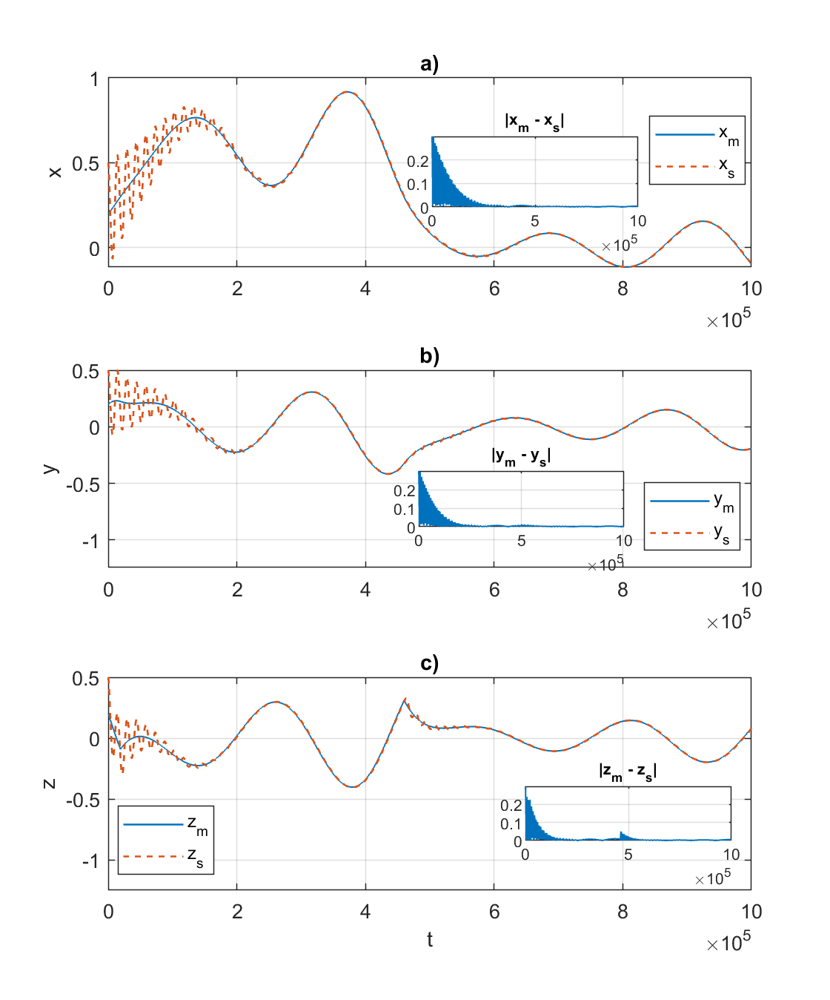
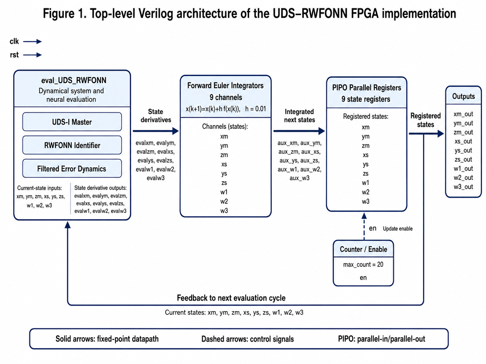
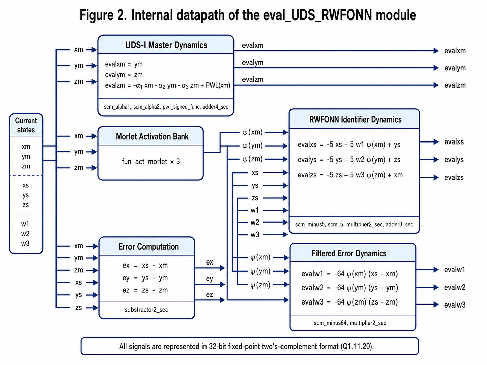
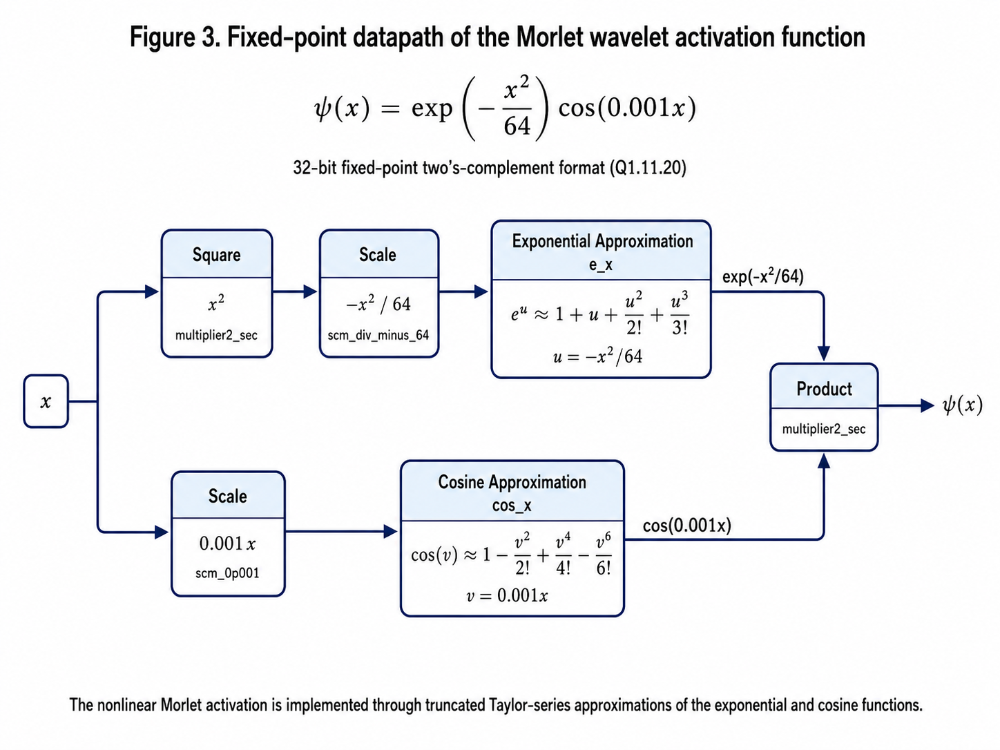

# Verilog-RWFONN-Chaotic-Identification

[](https://matlab.mathworks.com/open/github/v1?repo=luisjavier-ontanon/Verilog-RWFONN-Chaotic-Identification&file=matlab_plotting/plot_UDS_RWFONN_csv.m)

## FPGA-Oriented Pre-Silicon Validation of an RWFONN for Chaotic Dynamical-System Identification

This repository contains Verilog, simulation data, MATLAB plotting scripts, scientific figures, and documentation for a **Verilog-based pre-silicon validation** of a **Recurrent Wavelet First-Order Neural Network (RWFONN)** [[1]](#ref-1)–[[3]](#ref-3) applied to chaotic dynamical-system identification.

The project focuses on the digital implementation of a neural identifier for an **Unstable Dissipative System of type I (UDS-I)** [[1]](#ref-1) using:

- 32-bit fixed-point two's-complement arithmetic,
- Q1.11.20 numerical representation,
- Forward Euler integration,
- Morlet wavelet activation functions,
- filtered-error dynamics,
- sequential datapath scheduling in Verilog.

The repository is intended for academic reproducibility, scientific dissemination, and future FPGA deployment.

---

## Project Status

Current status:

- **Pre-silicon Verilog validation**
- HDL simulation performed with standard Verilog source files and testbenches
- CSV signal export for post-processing
- MATLAB scripts for visualization of identification performance
- Physical FPGA validation: **pending**
- Hardware target: **to be confirmed**

This repository does not currently claim a complete physical FPGA implementation. It provides the Verilog architecture, simulation workflow, generated signals, and plotting scripts required to reproduce the pre-silicon validation stage.

---

## Authors

**O. Guillen-Fernández**<sup>1</sup>,  
**D. A. Magallon-Garcia**<sup>2,3</sup>,  
**I. Diaz-Allen**<sup>4</sup>,  
**E. Campos-Cantón**<sup>4</sup>,  
**J. H. García-López**<sup>5</sup>,  
**L. J. Ontanon-Garcia**<sup>*2</sup>

<sup>1</sup> Department of Electronics, INAOE, Tonantzintla, Puebla 72840, México.  
<sup>2</sup> Coordinación Académica Región Altiplano Oeste, UASLP, Salinas 78600, San Luis Potosí, México.  
<sup>3</sup> Preparatoria Regional de Lagos de Moreno, Universidad de Guadalajara, Lagos de Moreno 47476, México.  
<sup>4</sup> División de Control y Sistemas Dinámicos, Instituto Potosino de Investigación Científica y Tecnológica A.C. (IPICyT), San Luis Potosí, México.  
<sup>5</sup> Optics, Complex Systems and Innovation Laboratory, Centro Universitario de los Lagos, Universidad de Guadalajara, Enrique Díaz de León 1144, Colonia Paseos de la Montaña, Lagos de Moreno 47463, México.  

<sup>*</sup> Corresponding author: luis.ontanon@uaslp.mx

---

## Scientific Motivation

Chaotic dynamical systems are highly sensitive to initial conditions and parameter variations. Their identification is challenging because small-state errors can grow rapidly, and their trajectories contain nonlinear, transient, and frequency-rich components.

Recurrent Wavelet First-Order Neural Networks are attractive for this problem because they combine:

- recurrent dynamics,
- filtered-error adaptation,
- compact first-order structure,
- Morlet wavelet activation functions,
- real-time-oriented neural identification.

The goal of this repository is to make available a Verilog-based digital architecture that moves the RWFONN methodology from numerical simulation toward FPGA-oriented electronic realization.

---

## Architecture Overview

The top-level Verilog module is:

```text
UDS_RWFONN.v
```

The architecture contains:

1. **UDS-I master dynamics**
   - Computes the reference chaotic system `xm`, `ym`, and `zm`.
   - Includes the piecewise-linear nonlinearity `PWL(xm)`.

2. **RWFONN identifier**
   - Computes the neural approximation states `xs`, `ys`, and `zs`.
   - Uses Morlet wavelet activation functions.

3. **Filtered-error dynamics**
   - Computes `w1`, `w2`, and `w3`.
   - Uses the state errors and Morlet activations.

4. **Forward Euler integrators**
   - Nine integration channels:
     - `xm`, `ym`, `zm`
     - `xs`, `ys`, `zs`
     - `w1`, `w2`, `w3`

5. **PIPO parallel registers**
   - Nine state registers.
   - Updated by a counter-generated enable signal.

6. **Counter / Enable block**
   - Generates the `en` signal.
   - Current setting: `max_count = 20`.

---

## Fixed-Point Format

All main signals are represented using a 32-bit fixed-point two's-complement format:

```text
Q1.11.20
```

That is:

- 1 sign bit
- 11 integer bits
- 20 fractional bits

The scaling factor is:

```text
2^20 = 1,048,576
```

Examples:

```text
1.0  -> 32'h0010_0000
0.5  -> 32'h0008_0000
0.2  -> 32'h0003_3333
pi/2 -> approximately 32'h0019_21F8
```

---

## Morlet Wavelet Activation

The implemented activation function is:

```text
psi(x) = exp(-x^2 / 64) cos(0.001 x)
```

The nonlinear terms are implemented with truncated Taylor-series approximations:

```text
e^u ≈ 1 + u + u^2/2! + u^3/3!
```

and

```text
cos(v) ≈ 1 - v^2/2! + v^4/4! - v^6/6!
```

The Verilog datapath for the activation is implemented in:

```text
fun_act_morlet.v
e_x.v
cos_x.v
```

---

## Repository Structure

```text
Verilog-RWFONN-Chaotic-Identification/
│
├── src/
│   ├── UDS_RWFONN.v
│   ├── eval_UDS_RWFONN.v
│   ├── fun_act_morlet.v
│   ├── e_x.v
│   ├── cos_x.v
│   ├── fe_integrator.v
│   ├── pipo_register.v
│   ├── counter.v
│   ├── multiplier2_sec.v
│   ├── adder2_sec.v
│   ├── adder3_sec.v
│   ├── adder4_sec.v
│   ├── substractor2_sec.v
│   ├── pwl_signed_func.v
│   └── scm_*.v
│
├── verilog_simulation/
│   ├── tb_UDS_RWFONN.v
│   └── simulation_notes.md
│
├── matlab_ploting/
│   ├── plot_UDS_RWFONN_csv.m
│   └── README_matlab_ploting.md
│
├── csv_signal/
│   └── UDS_RWFONN_9signals.csv
│
├── figures/
│   ├── matlab_identification_results.png
│   ├── top_level_verilog_architecture_diagram.png
│   ├── internal_datapath_of_eval_uds_rwfonn_module.png
│   └── fixed_point_datapath_of_morlet_wavelet.png
│
├── docs/
│   ├── related_publications.md
│   └── architecture_description.md
│
├── README.md
└── LICENSE
```

---

## Included Figures

### 1. MATLAB identification results

This figure compares the master UDS-I states and the RWFONN-identified states. Insets show the magnitude of the synchronization error for each state pair.



### 2. Top-level Verilog architecture

This figure summarizes the full top-level datapath: `eval_UDS_RWFONN`, Forward Euler integrators, PIPO registers, counter/enable logic, and feedback loop.



### 3. Internal datapath of `eval_UDS_RWFONN`

This figure shows the internal structure of the master system, the Morlet activation bank, the RWFONN identifier dynamics, error computation, and the filtered-error dynamics.



### 4. Fixed-point datapath of the Morlet activation function

This figure illustrates the fixed-point implementation of the Morlet wavelet activation function using truncated Taylor-series approximations of the exponential and cosine terms.



---

## MATLAB Plotting

The CSV signals generated by the Verilog simulation can be plotted using MATLAB.

The MATLAB scripts are located in:

```text
matlab_plotting/
```

The signal files are located in:

```text
csv_signal/
```

The MATLAB workflow includes:

- reading exported CSV signals;
- reconstructing fixed-point values as real numbers;
- comparing the master system states and the RWFONN identifier states;
- plotting:
  - `xm` vs. `xs`
  - `ym` vs. `ys`
  - `zm` vs. `zs`
- plotting the pointwise synchronization errors:
  - `|xm - xs|`
  - `|ym - ys|`
  - `|zm - zs|`

---


## Verilog Simulation

The Verilog code is simulator-oriented and was designed as a pre-silicon validation workflow.

The repository includes a testbench:

```text
verilog_simulation/tb_UDS_RWFONN.v
```

The testbench exports the simulation results to CSV format for MATLAB post-processing.

### Recommended simulation approach

This repository is intended to be simulator-independent at the RTL level. The Verilog source files and testbench can be adapted to different HDL simulation environments.

For a fully open-source local simulation workflow, Icarus Verilog is recommended as the primary starting point. Icarus Verilog is distributed under the GPL-2.0 license and supports Verilog, with partial support for SystemVerilog constructs.

Other HDL simulation environments, such as academic HDL simulators, EDA Playground, and vendor FPGA simulation tools, may also be used for validation. However, these alternatives are not necessarily open source. They are mentioned only as possible simulation environments, not as requirements for reproducing the repository.

Depending on the simulator and directory structure, file paths in the testbench may need to be adjusted before running.

---

## HDL Tool Note

This repository distributes the authors' Verilog source code, MATLAB plotting scripts, figures, and generated CSV signal data.

It does **not** redistribute proprietary HDL simulation software, vendor libraries, installation files, license files, or proprietary simulator binaries.

If results are generated using a specific proprietary or student-edition simulator, users should verify that their license permits the intended use. The repository is intended to remain reproducible with standard HDL source files and, when possible, open-source or generally available simulation workflows.

---

## References

### Core RWFONN and neural-identification works

<a id="ref-1"></a>
[1] D. A. Magallón-García et al.,  
“RWFONN-based identification of chaotic dynamical systems,”  
manuscript pending publication. Final bibliographic information will be updated after peer review and formal publication.

<a id="ref-2"></a>
[2] D. A. Magallón-García et al.,  
“Real-time RWFONN validation on field-programmable analog arrays,”  
manuscript pending publication. Final bibliographic information will be updated after peer review and formal publication.

<a id="ref-3"></a>
[3] J. L. Echenausía-Monroy et al.,  
“A recurrent neural network for identifying multiple chaotic systems,”  
manuscript pending publication. Final bibliographic information will be updated after peer review and formal publication.

### FPGA and numerical-method references relevant to this repository

<a id="ref-4"></a>
[4] O. Guillen-Fernandez, M. F. Moreno-Lopez, and E. Tlelo-Cuautle,  
“Issues on applying one- and multi-step numerical methods to chaotic oscillators for FPGA implementation,”  
*Mathematics*, vol. 9, no. 2, article 151, 2021.

<a id="ref-5"></a>
[5] A. Sambas, S. Vaidyanathan, E. Tlelo-Cuautle, B. Abd-El-Atty, A. A. Abd El-Latif, O. Guillén-Fernández, et al.,  
“A 3-D multi-stable system with a peanut-shaped equilibrium curve: Circuit design, FPGA realization, and an application to image encryption,”  
*IEEE Access*, vol. 8, pp. 137116–137132, 2020.

<a id="ref-6"></a>
[6] S. Vaidyanathan, E. Tlelo-Cuautle, O. Guillén-Fernández, K. Benkouider, and A. Sambas,  
“A New 4-D Hyperchaotic System with No Balance Point, Its Bifurcation Analysis, Multi-Stability, Circuit Simulation, and FPGA Realization,”  
in G. Huerta Cuéllar, E. Campos Cantón, and E. Tlelo-Cuautle, Eds., *Complex Systems and Their Applications*.  
Cham: Springer, 2022.  
https://doi.org/10.1007/978-3-031-02472-6_9

### Publication Status

The work presented in this repository is associated with a manuscript that is currently pending publication. The repository is provided as a pre-publication research artifact to document the Verilog implementation, simulation workflow, MATLAB post-processing scripts, and supporting data used for pre-silicon validation.

The bibliographic information, including the final citation, DOI, journal or conference venue, volume, issue, year, and page numbers, will be updated after the completion of the peer-review process and formal publication.

Until the peer-reviewed version becomes available, this repository should not be cited as a final published article. Please refer to it as a pre-publication repository associated with ongoing academic work.

---

## Citation

If you use this repository for academic or research purposes, please cite it as:

```text
O. Guillen-Fernández, D. A. Magallon-Garcia, I. Diaz-Allen,
E. Campos-Cantón, J. H. García-López, and L. J. Ontanon-Garcia,
"Verilog-RWFONN-Chaotic-Identification,"
GitHub repository, 2026.
[Online]. Available: https://github.com/luisjavier-ontanon/Verilog-RWFONN-Chaotic-Identification
```

After publication of the associated paper, please cite the paper as the primary reference.

---

## License

Recommended licensing scheme:

- Verilog source code and MATLAB scripts: **BSD-3-Clause License**
- Documentation, explanatory figures, and educational material: **CC BY-NC 4.0**, if a non-commercial educational restriction is desired

If a single license is preferred for the entire repository, **BSD-3-Clause** is recommended for simplicity and software compatibility.

See the `LICENSE` file for details.

---

## Acknowledgments

L.J.O.G. thanks the Potosino Council of Science and Technology (COPOCYT) for the support in Trust project 23871 of the 2023-01 Call.

The authors acknowledge the academic and research institutions involved in the development of this project.

---

## Contact

For questions related to this repository, please contact:

**L. J. Ontanon-Garcia**  
Coordinación Académica Región Altiplano Oeste, UASLP  
Email: luis.ontanon@uaslp.mx
